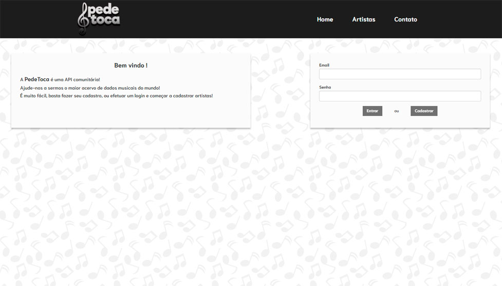

# Pede & Toca
A PeteToca é uma API com a finalidade de criar uma biblioteca de artistas

## Motivo
Este foi um exercício extra da Laboratoria - especialização em React.

O requesito era criar uma SPA (Single Page Aplication), onde a pessoa pode logar, postar e deletar elementos da API.

## Aparência

